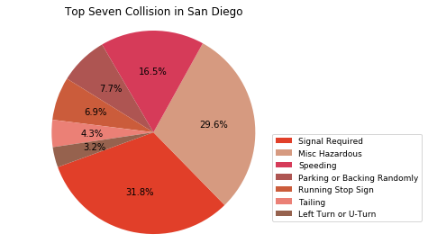

# SD-Collision-Hotspots

## Analysis of Traffic Collision Data in the City of San Diego 

In this project we have taken data produced by the City of San Diego, Police Division, which contains traffic collision data from 2018-Present.
Using this data and various data analysis tools, we search to find meaningful insights on traffic collisions in the City of San Diego. The ulitmate goal is to use these insights to make recommendations on how to reduce traffic collisions.

### Questions & Conclusions

* What are the most common causes of collision in San Diego? What are San Diego zip codes with a high volume of collisions?

  * Findings: The most common causes of collisions in San Diego include “No Turning Signals”, “Speeding”, “Vehicle Code Violation”, etc. 

