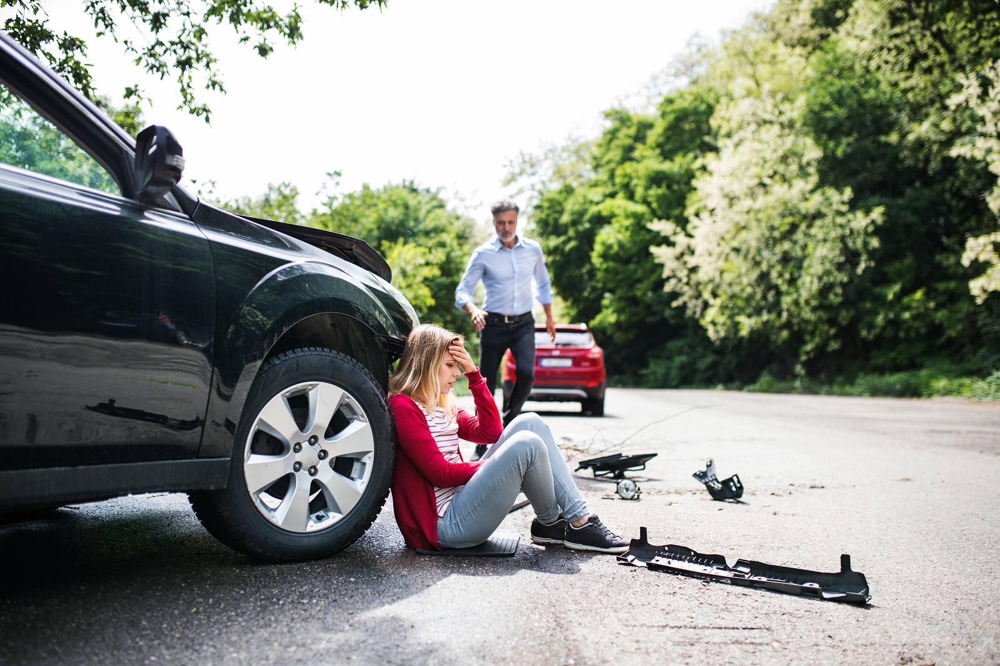
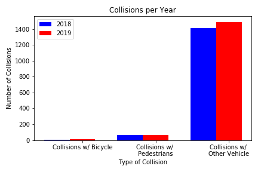
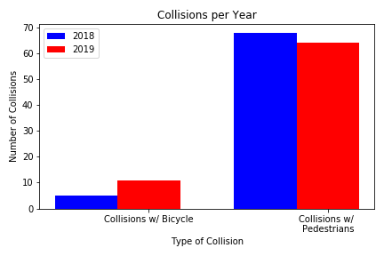
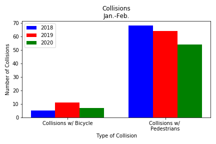
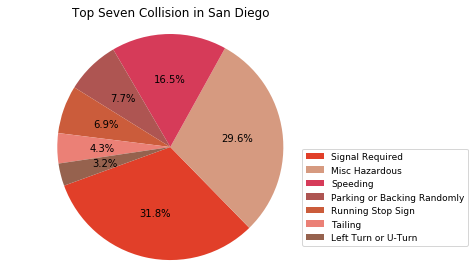
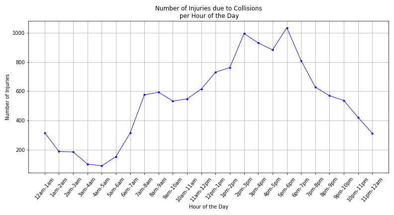
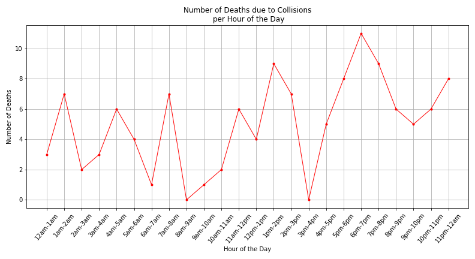
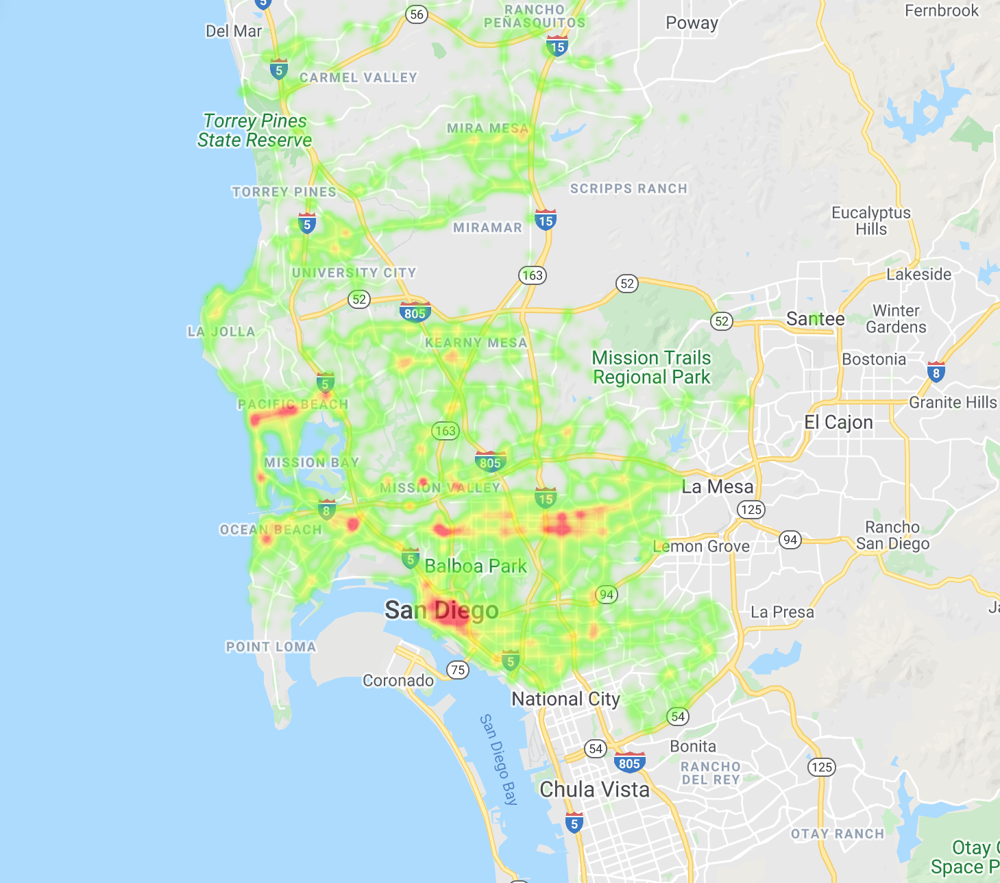

# SD-Collision-Hotspots

## Analysis of Traffic Collision Data in the City of San Diego 

In this project we have taken data produced by the City of San Diego - Police Division, which contains traffic collision data from 2018-Present.
Using this data and various data analysis tools, we search to find meaningful insights on traffic collisions in the City of San Diego. The ultimate goal is to use these insights to make recommendations on how to reduce traffic collisions.

### Questions & Conclusions

* What is the total number of collisions involving pedestrians, bicyclists, and other motor vehicles? Is one a greater problem than the other. 

  * **Findings:** Vehicle to vehicle collisions, by far, outnumber the collisions with pedestrians and bicyclists. Collisions with other motor vehicles were thousands, while collisions amongst the other two categories remained under 200.
		When looking at the data between Pedestrians and Bicylcists, we can see that collisions with pedestrians is the larger issue. This can be due to the sheer number of people vs bicyclist on the road, but this information 
		confirms that we should probably deploy more resources into making the streets safer for pedestrians, rather than bicyclist, which is where it seems a lot of resources tend to go. Further looking at the data for just Jan. to 
		Feb. and including 2020, we can see that collisions amongst these two groups have declined withing 2020 from the prior years.

* What are the most common causes of collision in San Diego? What are San Diego zip codes with a high volume of collisions?

  * **Findings:** The most common causes of collisions in San Diego include “No Turning Signals”, “Speeding”, “Vehicle Code Violation”, etc. Also, these collisions most commonly happen in high populated areas in San Diego such as: Pacific Beach, Mission Valley, Clairemont, etc.
		  These findings are consistent with my experience living and commuting in San Diego. Based on these findings, we can inform drivers of their behaviors and help avoid more collisions. 

* How do number of injuries/deaths due to collisions vary over the course of a day?

  * **Findings:** Our data, when grouped by hour of the day, shows that the injuries from collisions are most common during rush hour traffic, from 5-6pm. The data also confirms that, as the day goes on, hour by hour, up until 6pm, the number
		  injuries due to traffic collision increases. Whereas, the number of deaths due to traffic collisions does not appear to have any correlation with the time of day. The recorded number of deaths per hour are so low, between 0 and 11,
		  and there appears to be no trend on what time a death due to collision will occur. In conclusion, we know we want to work on stopping collision during the "rush hour" times of the day.

  
* Where are collision hotspots in San Diego? Can we view these geo-spatially using a heatmap?

  * **Findings:** Collisions are most common near busy cross streets, popular tourist & social destinations, and freeway off-ramps. Areas with higher population density also tend to have higher incidents of collisions.

## Source Data
* https://data.sandiego.gov/datasets/police-collisions/

